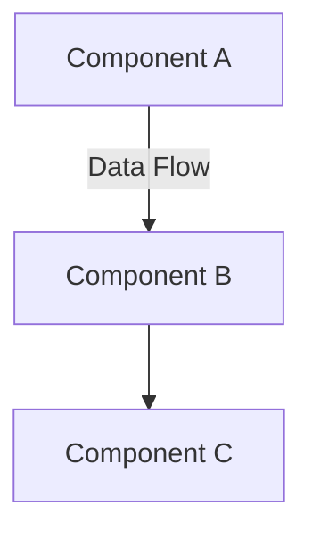
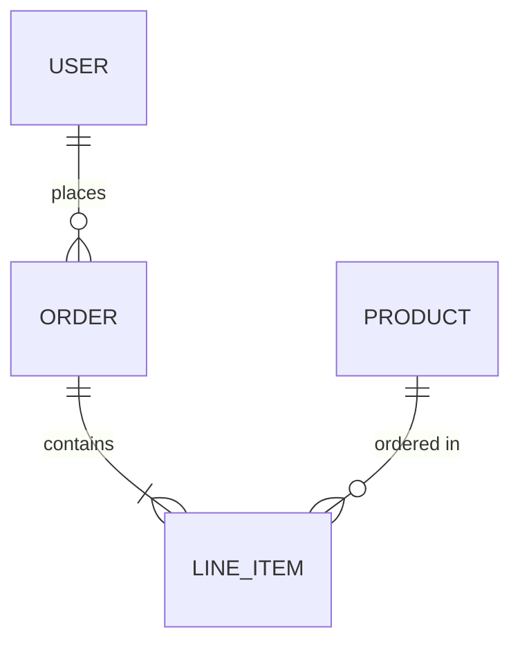

# MkDocs Documentation Standards

This guide defines documentation standards for AI agents and human developers to maintain comprehensive, up-to-date documentation that captures knowledge beyond what code can express.

## Where Must Be Documented

**Target Documentation Structure**

```
README.md              # Root: Project overview and quick start
CONTRIBUTING.md        # Root: Contribution guidelines and setup
CHANGELOG.md           # Root: Version history and release notes
LICENSE                # Root: AGPL-3.0 license text
AGENTS.md              # Root: Agentic development rules (humans + AI)

docs/
├── index.md                      # Home: Documentation portal (mirrors README.md)
├── changelog.md                  # Home: Version history (mirrors CHANGELOG.md)
├── contributing.md               # Home: Contribution guide (mirrors CONTRIBUTING.md)
├── license.md                    # Home: License details (mirrors LICENSE)
│
├── guide/                        # 👤 USER-FACING: How to use the product
│   ├── quickstart.md             # Tutorial: Getting started in 5 minutes
│   ├── installation.md           # Tutorial: Installation and setup
│   ├── configuration.md          # Reference: Configuration options and environment
│   ├── best-practices.md         # Guide: Recommended usage patterns
│   ├── template-usage.md         # Guide: Template-specific features
│   └── troubleshooting.md        # Reference: Common issues and solutions
│
├── architecture/                        # 🏗️ SYSTEM DESIGN: What the system does and why
│   ├── overview.md                      # Guide: High-level system architecture and diagrams
│   ├── functional-requirements.md       # Spec: Business logic and user stories
│   ├── non-functional-requirements.md   # Spec: Performance, security, scalability
│   ├── data-models.md                   # Reference: Domain entities and relationships
│   └── decisions/                       # 📋 ADRs: Architecture Decision Records
│       ├── adr-001-template.md          # Template: ADR format and structure
│       └── adr-002-example.md           # Example: Sample architecture decision
│
├── development/                  # 🛠️ DEVELOPER GUIDANCE: How to build and maintain
│   ├── _constitution.md          # Standards: AI agent coding rules (NON-NEGOTIABLE)
│   ├── mkdocs.md                 # Standards: Documentation guidelines (this file)
│   ├── license-audit.md          # Guide: AGPL-3.0 compliance requirements
│   ├── testing.md                # Guide: Testing strategies and patterns
│   └── workflows.md              # Guide: CI/CD pipelines and development flows
│
└── api/                          # 📚 API REFERENCE: Technical specifications
    ├── reference.md              # Reference: Auto-generated API docs (from docstrings)
    ├── integration-guide.md      # Tutorial: How to integrate with external systems
    └── contracts.md              # Spec: API contracts, schemas, and guarantees
```

**Documentation Responsibilities by Purpose**

| Directory | Audience | Content Type | Update Trigger | Quality Bar |
|-----------|----------|--------------|----------------|-------------|
| `guide/` | End users | Tutorials, how-tos | New features, UX changes | User can complete task in <10 min |
| `architecture/` | Architects, senior devs | Design decisions, diagrams | System design changes | Explains "why" not just "what" |
| `architecture/decisions/` | All developers | ADR records | Major technical decisions | Immutable after approval |
| `development/` | Contributors | Guidelines, standards | Process/tool changes | Enforceable via pre-commit |
| `api/` | Integrators, API consumers | Reference specs | Public API changes | Auto-generated + versioned |

**AI Agent Documentation Protocol**

When you modify code, update documentation in this **exact order**:

1. **`development/*.md`** → if developer processes or tools change
1. **`architecture/overview.md`** + diagrams → if component relationships change
1. **`architecture/decisions/adr-NNN.md`** → if you make a significant architectural choice
1. **`architecture/functional-requirements.md`** → if business logic or user stories change
1. **`api/reference.md`** + `api/contracts.md` → if public interfaces/contracts change
1. **`guide/*.md`** → if user-facing features or workflows change
1. **`CHANGELOG.md`** → ALWAYS update with user-facing changes

**Documentation Quality Gates**

Before marking documentation complete:

- [ ] All diagrams use Mermaid.js (no external images)
- [ ] All code examples are tested and runnable
- [ ] All links resolved (no 404s in `mkdocs build --strict`)
- [ ] All pages in `mkdocs.yml` nav structure
- [ ] Changelog updated with user-visible changes
- [ ] ADRs follow template and are immutable once approved

**Common Documentation Triggers**

| Code Change | Required Docs Update |
|-------------|---------------------|
| New CLI command | `guide/quickstart.md`, `api/reference.md` |
| New config option | `guide/configuration.md`, `api/contracts.md` |
| Breaking API change | `CHANGELOG.md`, `api/contracts.md`, ADR |
| New module/class | `api/reference.md`, `architecture/overview.md` |
| Algorithm change | `architecture/functional-requirements.md`, ADR |
| Security fix | `CHANGELOG.md`, `development/license-audit.md` |
| Performance optimization | `architecture/non-functional-requirements.md` |

## What Must Be Documented

### 1. User Guides and Tutorials → `guide/`

**Trigger**: New features, UX changes, configuration options, troubleshooting scenarios

**Target Files**:

- `guide/quickstart.md` → 5-minute tutorials for first-time users
- `guide/installation.md` → Platform-specific setup instructions
- `guide/configuration.md` → Complete configuration reference with defaults
- `guide/best-practices.md` → Recommended patterns and anti-patterns
- `guide/troubleshooting.md` → Common errors with diagnostic steps

**Content Requirements**:

- ✅ Step-by-step instructions with working code examples
- ✅ Expected outputs and success criteria at each step
- ✅ Platform variations (Linux/macOS/Windows) where applicable
- ✅ Configuration options table: name, type, default, description
- ✅ Error messages mapped to root causes and solutions

**Quality Bar**: User can complete task in <10 minutes without external help

### 2. System Architecture Overview → `architecture/overview.md`

**Trigger**: Component added/removed, relationships changed, integration points modified

**Target Files**:

- `architecture/overview.md` → High-level system design and component diagrams

**Content Requirements**:

- ✅ Component diagram (Mermaid.js) showing major system parts
- ✅ Data flow diagram showing transformations and boundaries
- ✅ Integration points with external systems
- ✅ Deployment architecture (if multi-service)
- ✅ Technology stack at each layer

**Quality Bar**: Senior developer can understand system design in <15 minutes

**Diagram Standards**:



- Use Mermaid.js (no external images)
- Include diagram source in markdown
- Add caption with purpose and last update date
- Maximum 7-10 boxes per diagram (split complex diagrams)

### 3. Architecture Decision Records → `architecture/decisions/`

**Trigger**: Technology choice, design pattern adoption, architectural trade-off, breaking change

**Target Files**:

- `architecture/decisions/adr-NNN-title.md` → Immutable decision records (append-only)

**Content Requirements** (follow `adr-001-template.md`):

1. **Status**: Proposed | Accepted | Superseded | Deprecated
2. **Context**: Problem statement, constraints, requirements
3. **Decision**: Chosen approach with technical details
4. **Alternatives**: Other options considered with pros/cons
5. **Rationale**: Why chosen approach wins over alternatives
6. **Consequences**: Positive/negative impacts, technical debt, migration costs

**Quality Bar**: Decision is defensible in code review, immutable once accepted

**Naming Convention**: `adr-{number}-{kebab-case-title}.md`

- Examples: `adr-003-use-ruff-for-linting.md`, `adr-012-adopt-event-sourcing.md`

### 4. Functional Requirements → `architecture/functional-requirements.md`

**Trigger**: Business logic change, new user story, validation rules modified, algorithm updated

**Target Files**:

- `architecture/functional-requirements.md` → What the system must do (behavior spec)

**Content Requirements**:

- ✅ User stories in format: "As a [role], I want [feature] so that [benefit]"
- ✅ Acceptance criteria (Given/When/Then format)
- ✅ Business rules and validation logic with examples
- ✅ Edge cases and error handling scenarios
- ✅ Domain constraints and invariants
- ✅ Input/output examples with boundary cases

**Quality Bar**: QA engineer can write test cases directly from requirements

**Example Format**:

```markdown
#### FR-042: Data Threshold Filtering

**User Story**: As a data analyst, I want to filter items by threshold so that I only see relevant data.

**Business Rule**: Include items where `value >= threshold`

**Acceptance Criteria**:
- Given threshold=0.5, when value=0.5, then item is included (boundary)
- Given threshold=0.5, when value=0.49, then item is excluded
- Given empty dataset, when filter applied, then raise ValueError

**Constraints**: Threshold ∈ [0.0, 1.0], data must have 'value' key
```

### 5. Non-Functional Requirements → `architecture/non-functional-requirements.md`

**Trigger**: Performance target defined, SLA committed, security requirement added, compliance needed

**Target Files**:

- `architecture/non-functional-requirements.md` → How well the system must perform

**Content Requirements**:

- ✅ **Performance**: Latency (p50/p95/p99), throughput (RPS/TPS), resource limits
- ✅ **Scalability**: Horizontal/vertical scaling targets, max users/data volume
- ✅ **Reliability**: Uptime SLA, MTBF, MTTR, disaster recovery RTO/RPO
- ✅ **Security**: Authentication/authorization, encryption, audit logging, threat model
- ✅ **Compliance**: GDPR, HIPAA, SOC2, AGPL-3.0 obligations
- ✅ **Observability**: Metrics, logs, traces, alerting thresholds

**Quality Bar**: Measurable, testable, monitorable in production

**Example Format**:

```markdown
#### NFR-001: API Response Time

**Requirement**: List API p95 latency < 200ms under normal load
**Measurement**: Prometheus histogram, 1-minute window
**Test**: Load test with 1000 RPS, measure p95 latency
**Monitoring**: Alert if p95 > 200ms for 5 consecutive minutes
```

### 6. Data Models and Entities → `architecture/data-models.md`

**Trigger**: New entity, relationship change, validation rules, state machine update, schema migration

**Target Files**:

- `architecture/data-models.md` → Domain entities, relationships, constraints

**Content Requirements**:

- ✅ Entity-Relationship diagram (Mermaid.js ERD)
- ✅ Entity definitions with field types and descriptions
- ✅ Relationship cardinality (1:1, 1:N, N:M)
- ✅ Field constraints (required, unique, range, pattern)
- ✅ State machines for entity lifecycle
- ✅ Privacy/PII classification (for GDPR compliance)

**Quality Bar**: Database schema can be generated from specification

**Diagram Example**:



### 7. API Reference and Contracts → `api/`

**Trigger**: Public API change, new endpoint, breaking change, versioning update

**Target Files**:

- `api/reference.md` → Auto-generated from docstrings (versioned)
- `api/contracts.md` → API guarantees, schemas, backward compatibility
- `api/integration-guide.md` → Step-by-step integration tutorial

**Content Requirements**:

**Reference** (auto-generated from code docstrings):

- Function/class signatures with type hints
- Parameter descriptions
- Return types and exceptions
- Usage examples

**Contracts** (manually curated):

- ✅ API versioning policy (e.g., semver for breaking changes)
- ✅ Request/response JSON schemas (JSON Schema or Pydantic)
- ✅ Backward compatibility guarantees
- ✅ Deprecation policy and timeline
- ✅ Error code catalog with meanings

**Integration Guide**:

- ✅ Authentication flow with code examples
- ✅ Rate limiting rules and retry logic
- ✅ Pagination, filtering, sorting patterns
- ✅ Webhook setup and payload formats

**Quality Bar**: External developer can integrate without asking questions

### 8. Development Standards → `development/`

**Trigger**: Coding standard updated, tool configuration changed, CI/CD modified, testing strategy evolved

**Target Files**:

- `development/_constitution.md` → Non-negotiable AI coding rules (enforced via pre-commit)
- `development/mkdocs.md` → Documentation update protocols (this file)
- `development/testing.md` → Testing patterns, fixtures, coverage requirements
- `development/workflows.md` → CI/CD, release process, deployment procedures
- `development/license-audit.md` → AGPL-3.0 obligations, dependency auditing

**Content Requirements**:

- ✅ **_constitution.md**: Immutable coding standards with rationale
- ✅ **mkdocs.md**: When/what/where to document, quality gates
- ✅ **testing.md**: Test pyramid, naming conventions, fixture patterns, 80%+ coverage
- ✅ **workflows.md**: GitHub Actions, pre-commit hooks, release checklist
- ✅ **license-audit.md**: AGPL-3.0 source disclosure, attribution, audit process

**Quality Bar**: Enforceable via automated tools (pre-commit, CI/CD)

### 9. Configuration Reference → `guide/configuration.md`

**Trigger**: New config option, environment variable added, secret management changed, deployment config updated

**Target Files**:

- `guide/configuration.md` → Complete configuration reference for operators

**Content Requirements**:

- ✅ Configuration options table: name, type, default, required/optional, description
- ✅ Environment variable mappings (e.g., `APP_LOG_LEVEL` → `logging.level`)
- ✅ Configuration file examples (YAML, TOML, .env)
- ✅ Platform-specific settings (dev/staging/prod)
- ✅ Secret management (where to store credentials, rotation policy)
- ✅ Security implications of each option

**Quality Bar**: DevOps can deploy to production without asking questions

**Example Format**:

```markdown
#### `database.connection_pool_size`

**Type**: `int`
**Default**: `10`
**Environment Variable**: `DB_POOL_SIZE`
**Required**: No
**Description**: Maximum number of database connections in the pool.
**Valid Range**: 1-100
**Security**: Increase for high-traffic environments, but monitor memory usage.
```

## Documentation Maintenance Protocol

### AI Agent Update Sequence

When modifying code, update documentation in this **exact order** (do not skip steps):

1. **`development/*.md`** → Update if you changed tools, standards, or workflows
   - Modified pre-commit hooks? → Update `workflows.md`
   - Changed testing patterns? → Update `testing.md`
   - Added dependency with different license? → Update `license-audit.md`

2. **`architecture/overview.md`** + diagrams → Update if component structure changed
   - Added/removed module or service? → Update component diagram
   - Changed data flow between components? → Update data flow diagram
   - Modified deployment architecture? → Update deployment diagram

3. **`architecture/decisions/adr-NNN.md`** → Create if you made architectural choice
   - Chose between competing approaches? → Write ADR
   - Made trade-off with long-term implications? → Document decision
   - Changed fundamental design pattern? → Create immutable ADR

4. **`architecture/functional-requirements.md`** → Update if business logic changed
   - Modified validation rules? → Update business rules
   - Added edge case handling? → Document new scenarios
   - Changed algorithm behavior? → Update acceptance criteria

5. **`architecture/non-functional-requirements.md`** → Update if performance/security changed
   - Changed SLA targets? → Update performance requirements
   - Added security measure? → Document in security section
   - Modified compliance posture? → Update compliance obligations

6. **`architecture/data-models.md`** → Update if entities or relationships changed
   - Added/removed entity? → Update ERD and entity definitions
   - Modified relationships? → Update cardinality in diagram
   - Changed validation constraints? → Update field constraints

7. **`api/reference.md`** + `api/contracts.md` → Update if public interfaces changed
   - Added/removed public function? → Regenerate reference.md from docstrings
   - Breaking API change? → Document in contracts.md with migration guide
   - Changed error codes? → Update error catalog

8. **`guide/*.md`** → Update if user-facing features changed
   - New feature? → Add to quickstart.md or best-practices.md
   - Configuration option? → Update configuration.md reference table
   - New error users might encounter? → Add to troubleshooting.md

9. **`CHANGELOG.md`** → **ALWAYS** update with user-visible changes
   - Format: `## [Unreleased]` → `### Added/Changed/Deprecated/Removed/Fixed/Security`
   - Link to issues/PRs for context
   - Use keep-a-changelog.com format

### Documentation Quality Gates

Before committing documentation changes, verify:

**✅ Content Quality**

- [ ] All diagrams use Mermaid.js (no PNG/JPG images)
- [ ] All code examples are tested and execute successfully
- [ ] All configuration options have: type, default, description, valid range
- [ ] All ADRs follow template: Status, Context, Decision, Alternatives, Rationale, Consequences
- [ ] All user stories have acceptance criteria in Given/When/Then format

**✅ Navigation & Links**

- [ ] New pages added to `mkdocs.yml` nav section (in logical order)
- [ ] All internal links validated (no 404s in `mkdocs build --strict`)
- [ ] All cross-references use correct relative paths
- [ ] All external links use HTTPS and are accessible

**✅ Formatting & Style**

- [ ] Markdown linting passes (no markdownlint errors)
- [ ] Consistent heading hierarchy (no skipped levels)
- [ ] Code blocks have language specified (```python, not```)
- [ ] Tables are properly formatted with alignment
- [ ] Lists use consistent bullet style (-, not *)

**✅ Completeness**

- [ ] Changelog updated with user-facing changes (version, date, category)
- [ ] API breaking changes have migration guide
- [ ] New features have quickstart example
- [ ] Security changes documented in compliance section
- [ ] Performance changes reflected in NFRs

### Human Developer Responsibilities

**When Creating New Features:**

1. Write user story in `architecture/functional-requirements.md` BEFORE coding
2. Define acceptance criteria for testing
3. Update architecture diagrams if new components introduced
4. Write API documentation in code docstrings (auto-generates reference.md)
5. Add quickstart example in `guide/quickstart.md`
6. Update CHANGELOG.md in "Unreleased" section

**When Reviewing Pull Requests:**

1. Verify documentation changes accompany code changes
2. Check that diagrams still match codebase
3. Ensure ADRs are immutable (no edits to accepted ADRs, only supersede)
4. Validate that `mkdocs build --strict` passes
5. Confirm changelog follows keep-a-changelog.com format

**When Making Breaking Changes:**

1. Create ADR documenting the decision and rationale
2. Update `api/contracts.md` with migration guide
3. Add deprecation notice to old API (if applicable)
4. Document in CHANGELOG.md under "Changed" or "Removed"
5. Update all affected guides and tutorials

### Linking Documentation to Code

**Best Practices:**

```markdown
<!-- Good: Specific module reference -->
See [process_data()](../api/reference.md#process_data) in `src/your_package_name/core.py`

<!-- Good: Link to source with line numbers -->
Implementation: [core.py:42-58](../../src/your_package_name/core.py#L42-L58)

<!-- Bad: Vague reference -->
See the core module for details

<!-- Bad: External link to GitHub (breaks for forks) -->
See https://github.com/user/repo/blob/main/src/core.py
```

**Code Example Standards:**

```markdown
<!-- Good: Runnable, with expected output -->
```python
from your_package_name import process_data

data = [{"value": 0.3}, {"value": 0.7}]
result = process_data(data, threshold=0.5)
print(result)  # Output: [{"value": 0.7}]
```

<!-- Bad: Incomplete, won't run -->
```python
result = process_data(data)  # What is data? Where does process_data come from?
```

```

### Documentation Anti-Patterns (Avoid These)

❌ **Stale Diagrams**: Diagram shows components that no longer exist
✅ **Fix**: Update diagrams in same PR that changes architecture

❌ **Vague Requirements**: "System should be fast"
✅ **Fix**: Specify measurable target: "API p95 latency < 200ms"

❌ **Missing ADR Context**: Decision documented without explaining alternatives
✅ **Fix**: Always include "Alternatives Considered" section in ADRs

❌ **Code-Only Documentation**: "See the code for details"
✅ **Fix**: Explain WHY in docs, code shows HOW

❌ **Outdated Examples**: Code examples use deprecated APIs
✅ **Fix**: Test examples in CI, fail build on import errors

❌ **Broken Internal Links**: `[link](old-page.md)` returns 404
✅ **Fix**: Use `mkdocs build --strict` in pre-commit to catch broken links

❌ **Duplicate Information**: Same content in README.md and docs/index.md diverges
✅ **Fix**: Make docs/index.md include/reference README.md (single source of truth)

❌ **Uncommitted Diagrams**: Mermaid source not in markdown, only rendered image
✅ **Fix**: Always include Mermaid source in markdown code blocks

❌ **Generic Troubleshooting**: "Check the logs"
✅ **Fix**: Specific error message → root cause → solution with commands

### Pre-Commit Hook Issue Patterns

**Ruff Formatting** (`ruff-format`)

- **Symptom**: Code style inconsistencies
- **Auto-fix**: Yes (runs automatically)
- **Manual fix**: Not needed, ruff reformats code
- **Prevention**: Enable format-on-save in VS Code

**Ruff Linting** (`ruff`)

- **Symptom**: Code quality violations (unused imports, undefined variables, etc.)
- **Auto-fix**: Partial (use `--fix` flag)
- **Manual fix**: Remove unused imports, fix variable names, add missing imports
- **Prevention**: Use IDE linting (VS Code Ruff extension)

**MyPy Type Errors** (`mypy`)

- **Symptom**: Type hint violations, missing type annotations
- **Auto-fix**: No
- **Manual fix**: Add type hints to all function signatures, use `typing` module for generics
- **Common errors**:
  - `error: Function is missing a return type annotation` → Add `-> ReturnType`
  - `error: Argument 1 has incompatible type` → Fix type mismatch or add `# type: ignore[arg-type]`
  - `error: Cannot find implementation or library stub` → Add to mypy overrides or install stubs
- **Prevention**: Enable mypy in IDE, write types as you code

**Markdown Lint** (`markdownlint`)

- **Symptom**: Markdown formatting issues
- **Auto-fix**: Yes (use `--fix` flag)
- **Manual fix**: Fix heading hierarchy, line length, list formatting
- **Common errors**:
  - `MD001`: Heading levels skip (e.g., # → ###) → Use incremental levels (# → ## → ###)
  - `MD013`: Line too long → Break lines at 200 chars or use tables/code blocks
  - `MD022`: Headings need blank lines → Add blank line before/after headings
  - `MD032`: Lists need blank lines → Add blank line before/after lists
- **Prevention**: Use VS Code markdownlint extension with auto-fix on save

**MkDocs Build Errors** (`mkdocs build --strict`)

- **Symptom**: Documentation build fails, broken links, missing nav entries
- **Auto-fix**: No
- **Manual fix approaches**:

1. **Missing Navigation Entries**:
   ```

   INFO - The following pages exist in docs/ but are not in nav:
     - development/_constitution.md

   ```
   → Add to `mkdocs.yml` nav section:
   ```yaml
   nav:
     - Development:
       - Constitution: development/_constitution.md
   ```

2. **Broken Internal Links**:

   ```
   WARNING - Doc file 'contributing.md' contains link '../CONTRIBUTING.md'
             but target is not found
   ```

   → **Option A**: Create docs/CONTRIBUTING.md that includes root file
   → **Option B**: Change link to GitHub URL: `https://github.com/user/repo/blob/main/CONTRIBUTING.md`
   → **Option C**: Use absolute path: `/CONTRIBUTING.md`

3. **Missing Target Pages**:

   ```
   WARNING - Link 'guide/data-processing.md' not found
   ```

   → Create the missing page or remove/update the link

4. **Wrong Relative Paths**:

   ```
   WARNING - Link '../../configs/README.md' resolves to '../configs/README.md'
             but not found
   ```

   → Calculate correct relative path from source page location
   → Verify target file exists in docs/ directory

**Pytest Failures** (`pytest`)

- **Symptom**: Test failures, assertion errors
- **Auto-fix**: No
- **Manual fix**: Fix code to match tests, or update test expectations if behavior intentionally changed
- **Common errors**:
  - `AssertionError: assert X == Y` → Verify expected value is correct
  - `ModuleNotFoundError` → Ensure test imports match actual module structure
  - `NameError: name 'fixture' is not defined` → Add missing pytest fixture or import
  - `TypeError: missing 1 required positional argument` → Update function call signature
- **Prevention**: Run `uv run pytest` before committing, use test-driven development (TDD)

**Pre-commit Configuration Issues**

- **Symptom**: `[ERROR] Your pre-commit configuration is unstaged`
- **Fix**: Run `git add .pre-commit-config.yaml`
- **Why**: Pre-commit validates the configuration that will be committed must be staged

**Stash Conflicts**

- **Symptom**: `[WARNING] Stashed changes conflicted with hook auto-fixes`
- **Fix**: Stage all changes before running pre-commit: `git add -A`
- **Why**: Pre-commit stashes unstaged changes; if hooks modify those files, conflicts occur
- **Prevention**: Keep workspace clean or stage all changes before running hooks

## Documentation Examples

### ✅ Excellent Functional Requirement Documentation

```markdown
#### FR-042: Data Threshold Filtering

**Status**: Implemented (v1.2.0)

**User Story**: As a data analyst, I want to filter dataset items by configurable threshold so that I only process relevant high-value data points.

**Business Rule**: Include items where `item.value >= threshold`, preserving original order.

**Acceptance Criteria**:

- **Given** threshold=0.5 **and** item.value=0.5, **when** filter applied, **then** item is included (boundary case)
- **Given** threshold=0.5 **and** item.value=0.49, **when** filter applied, **then** item is excluded
- **Given** empty dataset, **when** filter applied, **then** raise ValueError with message "Data cannot be empty"
- **Given** item missing 'value' key, **when** accessed, **then** raise KeyError with helpful message
- **Given** item.value is string, **when** comparison attempted, **then** raise TypeError "Value must be numeric"

**Constraints**:

- Threshold ∈ [0.0, 1.0] (inclusive)
- Data must be non-empty list
- Each item must be dict with 'value' key
- Value must be numeric (int or float)

**Example**:

```python
from your_package_name import process_data

# Normal case
data = [{"value": 0.3}, {"value": 0.7}, {"value": 0.9}]
result = process_data(data, threshold=0.5)
assert result == [{"value": 0.7}, {"value": 0.9}]

# Boundary case
data = [{"value": 0.5}]
result = process_data(data, threshold=0.5)
assert result == [{"value": 0.5}]  # Boundary is included

# Error case
try:
    process_data([], threshold=0.5)
except ValueError as e:
    assert str(e) == "Data cannot be empty"
```

**Test Coverage**: `tests/test_core.py::TestProcessData` (14 test cases, 100% branch coverage)

**Related**: ADR-015 (chose >= over > for inclusive boundary), `architecture/data-models.md#DataItem`

```

### ✅ Excellent Architecture Decision Record

```markdown
# ADR-003: Use Ruff for Python Code Quality

**Status**: Accepted (2024-01-15)

**Context**:

We need a unified solution for Python code formatting and linting to ensure consistency across the codebase and reduce CI/CD time. Currently, we use:

- Black (formatting)
- isort (import sorting)
- flake8 (linting)
- pylint (additional checks)

This requires 4 separate tool configurations and sequential execution in pre-commit hooks, taking ~8 seconds per commit.

**Decision**:

Adopt Ruff as the single tool for formatting and linting, replacing Black, isort, flake8, and pylint.

**Alternatives Considered**:

1. **Keep existing toolchain (Black + isort + flake8 + pylint)**
   - **Pros**: Mature, well-known, stable
   - **Cons**: Slow (8s per commit), 4 configs to maintain, sequential execution
   - **Rejected**: Speed is critical for developer experience

2. **Use pylint as primary linter**
   - **Pros**: Comprehensive checks, plugin ecosystem
   - **Cons**: Slowest option (12s), opinionated rules hard to configure
   - **Rejected**: Performance unacceptable for pre-commit hook

3. **Adopt Ruff for linting + Black for formatting**
   - **Pros**: Incremental migration, keeps familiar Black
   - **Cons**: Still 2 tools, minor savings (6s → 4s)
   - **Rejected**: Ruff formatter is compatible with Black, full replacement better

**Rationale**:

- **Performance**: Ruff is 10-100x faster (~500ms vs 8s for our codebase)
- **Simplicity**: Single tool, single configuration file (`pyproject.toml`)
- **Compatibility**: Ruff format matches Black output byte-for-byte
- **Features**: Covers 90% of linting rules we use, actively developed
- **Integration**: Native VS Code extension, pre-commit support

**Consequences**:

**Positive**:

- ✅ Pre-commit hooks run in <1s instead of 8s (87% faster)
- ✅ CI/CD linting stage reduced from 30s to 3s
- ✅ Single configuration in `pyproject.toml` instead of 4 files
- ✅ Automatic fixes for most issues (`ruff --fix`)

**Negative**:

- ⚠️ Less mature than Black (v0.1.0 vs v23.0.0), but stable since v0.0.250
- ⚠️ Some pylint rules not available (acceptable: only affected 2 edge cases in audit)
- ⚠️ Team must learn new tool (mitigated: config is similar, docs excellent)

**Migration**:

1. Add `ruff` to `pyproject.toml` dependencies ✅ Done
2. Configure Ruff to match Black + isort settings ✅ Done
3. Run `ruff --fix` on codebase ✅ Done (0 changes, already compliant)
4. Update `.pre-commit-config.yaml` ✅ Done
5. Remove Black, isort, flake8, pylint ✅ Done
6. Update CI/CD workflows ✅ Done

**Review Date**: 2024-07-15 (6 months post-adoption)

**Related**: `development/workflows.md#pre-commit`, `pyproject.toml#tool.ruff`
```

### ✅ Excellent API Contract Documentation

```markdown
## POST /api/v1/data/process

**Description**: Process dataset with configurable threshold filtering.

**Authentication**: Required (Bearer token)

**Rate Limit**: 100 requests/minute per API key

**Request**:

```json
{
  "data": [
    {"value": 0.3, "metadata": {"optional": "extra fields"}},
    {"value": 0.7}
  ],
  "threshold": 0.5,
  "options": {
    "preserve_order": true,
    "include_boundary": true
  }
}
```

**Schema**:

```python
class ProcessRequest(BaseModel):
    data: List[Dict[str, Any]]  # Must contain 'value' key (numeric)
    threshold: float = Field(ge=0.0, le=1.0, default=0.5)
    options: ProcessOptions = ProcessOptions()

class ProcessOptions(BaseModel):
    preserve_order: bool = True
    include_boundary: bool = True  # Include items where value == threshold
```

**Response** (200 OK):

```json
{
  "result": [
    {"value": 0.7}
  ],
  "metadata": {
    "input_count": 2,
    "output_count": 1,
    "threshold_used": 0.5,
    "processing_time_ms": 12
  }
}
```

**Error Responses**:

| Code | Error | Meaning | Action |
| ------ | ------- | --------- | -------- |
| 400 | `EMPTY_DATASET` | Request data array is empty | Provide non-empty data array |
| 400 | `INVALID_THRESHOLD` | Threshold not in [0.0, 1.0] | Use threshold between 0.0 and 1.0 |
| 400 | `MISSING_VALUE_KEY` | Item missing 'value' field | Ensure all items have 'value' key |
| 401 | `UNAUTHORIZED` | Missing or invalid auth token | Include valid Bearer token |
| 429 | `RATE_LIMIT_EXCEEDED` | >100 req/min | Wait for rate limit reset (see Retry-After header) |
| 500 | `INTERNAL_ERROR` | Server error | Retry with exponential backoff |

**Example**:

```bash
curl -X POST https://api.example.com/v1/data/process \
  -H "Authorization: Bearer YOUR_API_KEY" \
  -H "Content-Type: application/json" \
  -d '{
    "data": [{"value": 0.3}, {"value": 0.7}],
    "threshold": 0.5
  }'
```

**Backward Compatibility**:

- ✅ `v1` API guaranteed stable until 2025-12-31
- ⚠️ `v2` planned for 2024-12-01 (deprecation notice sent 2024-06-01)
- 📋 Breaking changes documented in changelog

**Changelog**:

- `v1.2.0` (2024-01-15): Added `include_boundary` option
- `v1.1.0` (2023-11-03): Added `preserve_order` option
- `v1.0.0` (2023-09-20): Initial release

```

### ❌ Poor Documentation Examples (Anti-Patterns)

**Bad Functional Requirement** (too vague):

```markdown
### Data Processing

The system should filter data based on some threshold value. Edge cases should be handled properly.
```

**Problems**: No acceptance criteria, no constraints, no examples, "properly" is subjective.

**Bad Architecture Decision** (missing context):

```markdown
## Use Ruff

We decided to use Ruff for linting. It's faster.
```

**Problems**: No alternatives considered, no consequences, no rationale beyond speed.

**Bad API Documentation** (incomplete):

```markdown
## /api/process

Processes data. Returns filtered results.

Request: `{"data": [...], "threshold": 0.5}`
```

**Problems**: No schema, no error codes, no authentication, no examples, vague description.

## Resources

- [MkDocs Official Documentation](https://www.mkdocs.org/)
- [Material for MkDocs](https://squidfunk.github.io/mkdocs-material/)
- [Mermaid.js Diagrams](https://mermaid.js.org/)
- [Architecture Decision Records](https://adr.github.io/)
